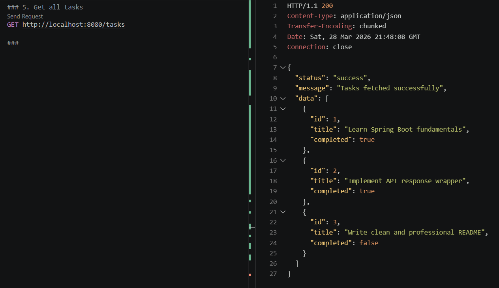
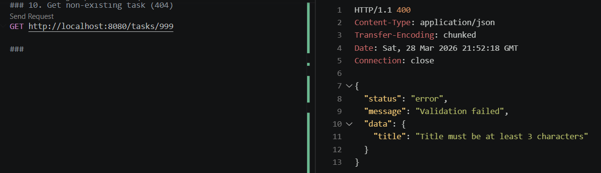
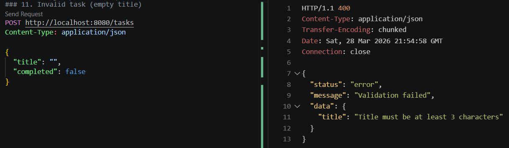

# Backend Learning Journey  

Backend engineering portfolio showcasing my transition from Mechanical Engineering to Backend Development using Java.

With 6+ years of experience in the engineering industry, I am now focused on building production-oriented backend systems using Java, Spring Boot, SQL, and REST APIs.

---

## What This Repository Demonstrates

This repository is a structured backend learning workspace focused on:

- Core Java fundamentals and internals  
- Backend architecture (layered design, DTO pattern, exception handling)  
- REST API development using Spring Boot  
- Database integration using PostgreSQL and JPA/Hibernate  
- Writing clean, maintainable backend code  
- Building real, testable backend services  

---

## Repository Structure  

backend-learning-journey/  
  
```
├── core-java/  
├── notes/  
├── projects/  
├── spring-boot/  
├── sql-practice/  
```
  
---

## Backend Services  

### Task Manager API (Spring Boot)

Location: `spring-boot/task-manager-api`  

A production-style backend service implementing full CRUD operations with database persistence.

---

### Architecture

Controller → Service → Repository → Database  

---

### Key Features

- Full CRUD REST API  
- PostgreSQL integration using Spring Data JPA  
- DTO pattern (Request / Response separation)  
- Validation using Jakarta annotations  
- Global exception handling (`@RestControllerAdvice`)  
- Structured logging (SLF4J)  
- Proper HTTP status codes (200, 201, 400, 404)  
- Consistent API response format  

---

### API Endpoints

| Method | Endpoint | Description |
|-------|--------|------------|
| POST | /tasks | Create task |
| GET | /tasks | Get all tasks |
| GET | /tasks/{id} | Get task by ID |
| PUT | /tasks/{id} | Update task |
| DELETE | /tasks/{id} | Delete task |

---

## API Preview

### Get All Tasks



---

### Task Not Found (404)



---

### Validation Error (400)



---

## Tech Stack

- Java 17  
- Spring Boot  
- Spring Web  
- Spring Data JPA  
- PostgreSQL  
- Maven  

---

## Learning Progress  

### Phase 1 — Core Java  
Completed  

### Phase 2 — Backend Development  
In Progress  

Completed:

- Spring Boot fundamentals  
- REST API development  
- PostgreSQL integration  
- DTO pattern  
- Validation  
- Exception handling  
- Logging  

---

## Goal  

To become a job-ready backend developer capable of building real-world backend systems using:

- Java  
- Spring Boot  
- SQL  
- REST APIs  

---

## Purpose  

This repository serves as a backend engineering portfolio demonstrating progression from core Java foundations to backend system development.