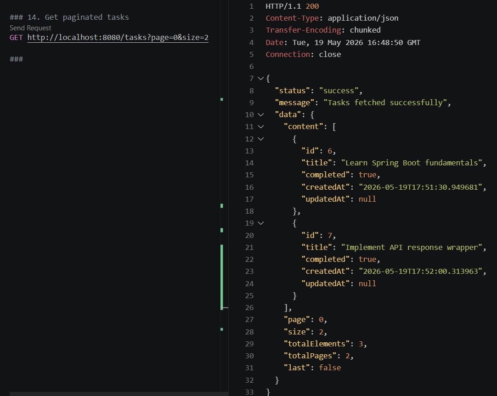
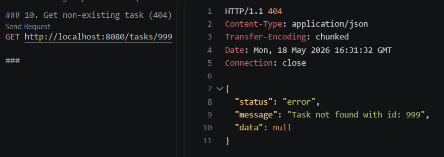
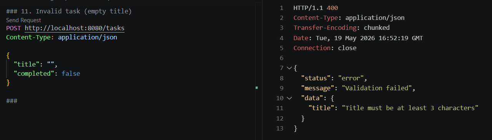

# Task Manager API

A Spring Boot REST API for managing tasks.

## Features

* Create tasks
* Retrieve tasks
* Update tasks
* Delete tasks
* Task filtering using query parameters
* Pagination and sorting
* DTO-based request and response handling
* Validation using Jakarta Validation
* Global exception handling
* Timestamp tracking (createdAt / updatedAt)
* PostgreSQL integration using Spring Data JPA
* Structured logging using SLF4J
* Proper HTTP status codes
* Swagger/OpenAPI documentation
* Service layer unit testing with JUnit 5 and Mockito

## Architecture

Controller → Service → Repository → Database

## Tech Stack

* Java 17
* Spring Boot
* Spring Web
* Spring Data JPA
* PostgreSQL
* Maven
* JUnit 5
* Mockito

## API Endpoints

| Method | Endpoint                                        | Description                       |
| ------ | ----------------------------------------------- | --------------------------------- |
| POST   | /tasks                                          | Create task                       |
| GET    | /tasks                                          | Get paginated tasks               |
| GET    | /tasks/{id}                                     | Get task by ID                    |
| GET    | /tasks?completed=true                           | Filter tasks by completion status |
| GET    | /tasks?page=0&size=5                            | Customize pagination              |
| GET    | /tasks?page=0&size=5&sortBy=title&direction=asc | Sorted and paginated tasks        |
| PUT    | /tasks/{id}                                     | Update task                       |
| DELETE | /tasks/{id}                                     | Delete task                       |

## Running the Application

Run the application:

mvn spring-boot:run

## Swagger UI

Interactive API documentation is available locally at:

http://localhost:8080/swagger-ui/index.html

## API Preview

### Get Tasks with Pagination

### Task Not Found (404)

### Validation Error (400)

## Testing

The project includes automated Controller and Service layer tests covering:

* Request validation
* Controller endpoint testing
* Task creation
* Task retrieval
* Task update
* Task deletion
* DTO mapping
* Filtering logic
* Pagination behavior
* Exception scenarios

Tools Used:

* JUnit 5
* Mockito

## Future Improvements

* Spring Security + JWT Authentication
* Integration Testing
* Dockerization
* Role-based Authorization
* CI/CD Pipeline Integration
* Cloud Deployment
